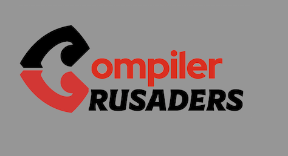
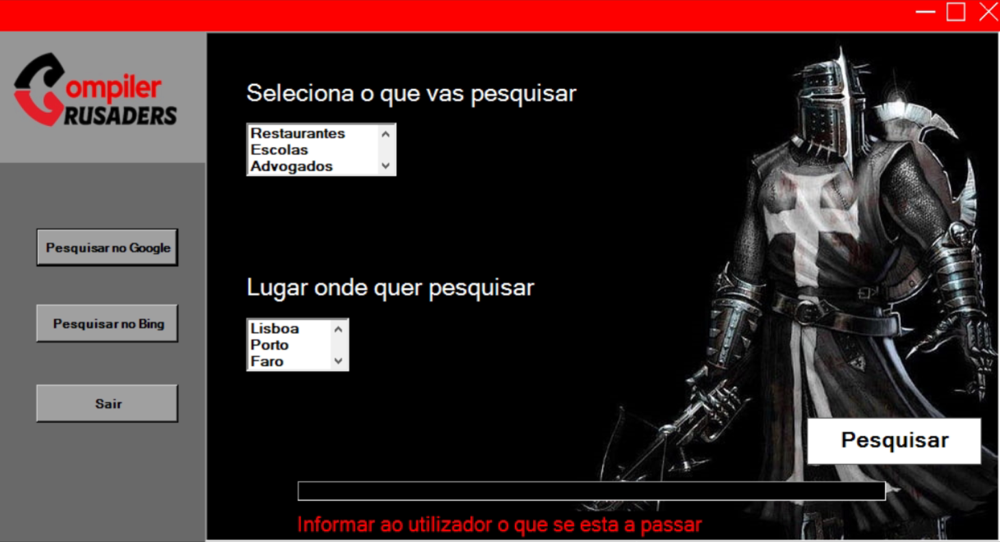
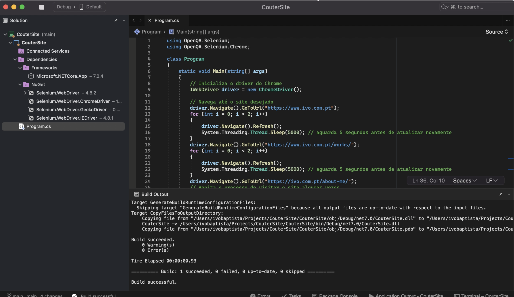

<h1 align="center">
    
</h1>

Trabalho de LDS

Bem-vindo ao App CounterSite!

O CounterSite é um aplicativo desenvolvido em linguagem C# que realiza pesquisas automáticas no Google ou no Bing, baseadas no tipo de negócio e localização, e exporta os dados para um arquivo CSV. Com o CounterSite, você pode coletar informações de contato, como e-mails, números de telefone e muito mais, de forma eficiente e prática.

O aplicativo é muito fácil de usar: basta inserir os termos de pesquisa desejados e o CounterSite cuidará do resto. Além disso, o programa permite criar um arquivo para armazenar as informações coletadas, que podem ser utilizadas como uma base de dados para futuros contatos.

O CounterSite é ideal para empresas de todos os tamanhos e segmentos, proporcionando economia de tempo e esforço na coleta de informações de contato relevantes.

Experimente o CounterSite agora mesmo e descubra como ele pode impulsionar o crescimento do seu negócio!

📌 Programa Coutersite
------------------

## Sintaxe para compilar:

<pre>utilizar o visual studio  </pre>

## Sintaxe para executar:
<pre>executar com run diretamente no visual studio</pre>

O projeto foi desenvolvido em C#.

The project was done with C#.

🎬 Video Demo:

[*Click para ver o video*]
(https://youtu.be/xqfR4fPgBVE)

🔧 Tecnologias utilizadas:
------------------

- C#
- Visual Studio
- Selenium

💬 Fale com Compiler Crusaders
------------------
[*Entre em contato com a equipa*](https://teams.microsoft.com/l/entity/2a527703-1f6f-4559-a332-d8a7d288cd88/_djb2_msteams_prefix_4226427084?context=%7B%22subEntityId%22%3Anull%2C%22channelId%22%3A%2219%3ABsxbN8saoth3fKmRHKYl0gyfaUGiT4g3YisMGUEtW0U1%40thread.tacv2%22%7D&groupId=f20cc04f-8389-4991-b8b2-3b82ac420080&tenantId=58e31257-f77f-4d58-9705-d0b6ea0f9ee4&allowXTenantAccess=false)

